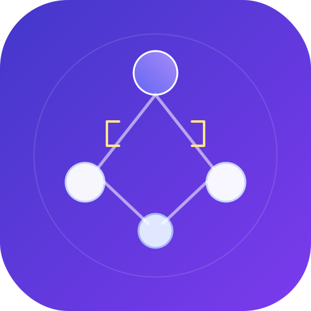
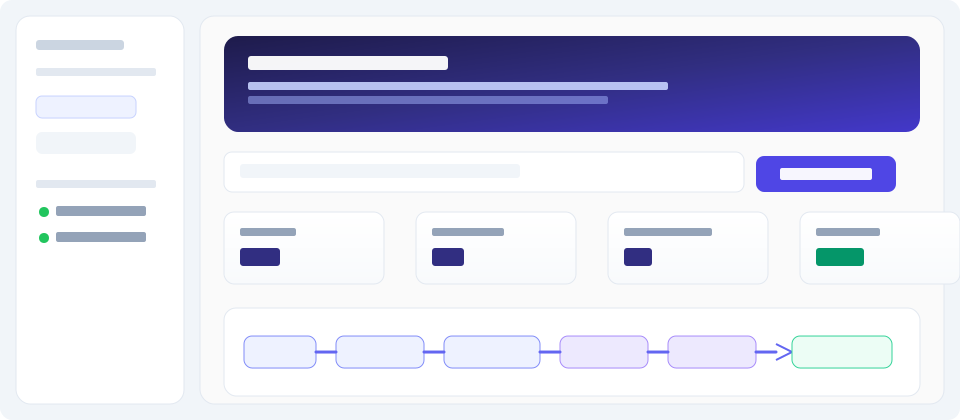
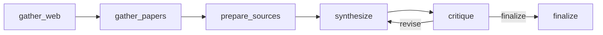

<p align="center">
  
</p>

<h1 align="center">CiteGraph</h1>

<p align="center">
  <strong>Evidence-bound research pipeline</strong><br/>
  <span>Dual-source retrieval · citation-native synthesis · critique loop · prompt audit</span>
</p>

<p align="center">
  
  &nbsp;
  <a href="./LICENSE"></a>
  &nbsp;
  <a href="https://makeapullrequest.com"></a>
  &nbsp;
  <a href="./AGENTS.md"></a>
  &nbsp;
  
  &nbsp;
  
  &nbsp;
  
</p>

<p align="center">
  <a href="https://github.com/ArttuAn/multi-agent-research-system"><strong>github.com/ArttuAn/multi-agent-research-system</strong></a><br/>
  <sub>This repository implements <strong>CiteGraph</strong> (the GitHub slug predates the name).</sub>
</p>

---

<p align="center">
  
</p>

<p align="center"><em>Illustrative mockup of the demo layout — run <code>streamlit run app.py</code> for the live UI.</em></p>

---

**CiteGraph** is a narrow take on “agent research”: it is built for **claims you can trace**. The graph merges **open web (Tavily)** and **scholarly metadata ([OpenAlex](https://openalex.org/))** into one **numbered source index** (`[Wn]` / `[Pn]`), forces the writer to **cite inline**, runs a **structured critique** (hallucination risk, issues, revision guidance), and can **loop** until approval or a cap—plus **prompt-trace PDF** and **LangSmith** for audit.

Default demo topic: **“AI regulation in Europe 2026”** (edit freely in the UI).

## What makes this different from generic multi-agent research demos

| Typical stack | CiteGraph |
|---------------|-----------|
| One RAG corpus or vague “search the web” | **Dual corpus**: news/pages *and* OpenAlex works, unified index |
| Free-form report | **Citation-native** draft tied to `[Wn]`/`[Pn]` tokens |
| Optional “self-critique” prose | **Schema-locked critic** (`approved`, risk, issues, guidance) + conditional **revise** edge |
| Black-box runs | **Per-step prompt audit PDF**, Streamlit **step I/O**, **LangSmith** spans per agent |
| Ad-hoc agent code | **Repeatable agent folders** with skills, hooks, guardrails, episodic memory ([AGENTS.md](AGENTS.md)) |

## Why LangGraph

This uses [LangGraph](https://github.com/langchain-ai/langgraph) for explicit graph state, conditional edges, and iteration—patterns closer to production agent orchestration than a single ReAct loop. *CrewAI* is a reasonable alternative for role-based crews; this repo standardizes on LangGraph for the graph-native control flow.

## Where are the agents?

Orchestration is **LangGraph** (`research_system/graph.py`). Each graph node delegates to a **LangChain** runnable in `research_system/agents/`, named for **LangSmith** (`run_name` + `tags`):

| LangGraph node | LangChain agent | Role |
|----------------|-----------------|------|
| `gather_web` | `WebResearchAgent` | Tavily retrieval (`RunnableLambda`) |
| `gather_papers` | `PaperResearchAgent` | OpenAlex works search (no API key) |
| `prepare_sources` | `SourceBundlerAgent` | Builds shared `[Wn]` / `[Pm]` source index |
| `synthesize` | `SynthesisAgent` | `ChatPromptTemplate` → `ChatOpenAI` → `StrOutputParser` |
| `critique` | `CritiqueAgent` | Prompt → structured output (`CritiqueResult`) |
| `finalize` | `FinalizeAgent` | Assembles final markdown (no LLM) |

Import from code: `from research_system.agents import web_research_agent, synthesis_agent, ...`.

**Per-agent layout (skills, memory, hooks, guardrails):** see **[AGENTS.md](AGENTS.md)** and each `research_system/agents/*/AGENT.md`.

## Architecture



- **gather_web**: Tavily `search` API (advanced depth).
- **gather_papers**: [OpenAlex](https://openalex.org/) `works` search API — **no API key**. Set **`OPENALEX_MAILTO`** in `.env` to your email for the [polite pool](https://docs.openalex.org/how-to-use-the-api/rate-limits-and-authentication) (better rate limits). The client **retries with backoff** on HTTP 429.
- **prepare_sources**: Builds a numbered index `[W1]…`, `[P1]…` so the writer and critic share the same evidence bundle.
- **synthesize**: LLM emits markdown with mandatory inline `[Wn]` / `[Pm]` citations.
- **critique**: Structured output (`approved`, `hallucination_risk`, `issues`, `revision_guidance`) comparing the draft to the source index only.
- **finalize**: Appends critique summary to the delivered report.

## LangSmith (monitoring)

1. Create a project and API key at [smith.langchain.com](https://smith.langchain.com/).
2. In `.env` (or Streamlit secrets), use **either** the names from the LangSmith UI **or** the LangChain-style names (the SDK checks `LANGSMITH_*` first, then `LANGCHAIN_*`):

```bash
# Same as LangSmith “Tracing” onboarding:
LANGSMITH_TRACING=true
LANGSMITH_API_KEY=your_langsmith_api_key
LANGSMITH_PROJECT=citegraph
LANGSMITH_ENDPOINT=https://api.smith.langchain.com
```

```bash
# Equivalent legacy names:
LANGCHAIN_TRACING_V2=true
LANGCHAIN_API_KEY=your_langsmith_api_key
LANGCHAIN_PROJECT=citegraph
```

`LANGSMITH_PROJECT` / `LANGCHAIN_PROJECT` must match the **project name** you selected in the LangSmith sidebar (e.g. `citegraph`), or traces will land in another project / default.

3. Run the app or `run_research(...)`. Traces show the **LangGraph** run with nested **agent** spans (`SynthesisAgent`, `CritiqueAgent`, etc.) and LLM calls.

**Versus the LangSmith docs snippet:** you do **not** need `@traceable` on every function here. This repo uses **LangChain runnables** (`RunnableLambda`, `ChatPromptTemplate | ChatOpenAI`, etc.); they emit runs automatically when tracing is enabled.

`langsmith` is listed in `requirements.txt`. The Streamlit app clears LangSmith’s env-var cache after each `load_dotenv` so `.env` edits apply on refresh; if traces still look stale, restart Streamlit once.

## Setup

```bash
python -m venv .venv
.venv\Scripts\activate   # Windows
# source .venv/bin/activate  # macOS/Linux
pip install -r requirements.txt
```

Create a **`.env`** file in the project root (it is gitignored). Use the variables below and in the **LangSmith** section above.

**Required**

- `TAVILY_API_KEY` — [Tavily](https://tavily.com/)
- `OPENAI_API_KEY` — OpenAI API

**Optional**

- `OPENAI_MODEL` (default `gpt-4o-mini`), `OPENALEX_MAILTO` (your email; recommended for OpenAlex)
- LangSmith: `LANGSMITH_TRACING=true`, `LANGSMITH_API_KEY`, `LANGSMITH_PROJECT`, … or the equivalent `LANGCHAIN_*` names (see **LangSmith** section)
- Optional: `AGENT_MEMORY_DIR` — directory for episodic JSONL store (default `data/agent_memory/` under the project)

## Tests

```bash
pytest tests/ -v
```

Coverage (no live APIs): **OpenAlex/Tavily clients** (mocked HTTP), **graph compile** and **node list**, **`should_revise` routing**, **execution trace** merge / step records, **source bundler** + **finalize** agents, **prompt formatters**, **CritiqueResult** schema, **LangSmith feed** latency helper. CI runs the same suite on push/PR.

## Live demo (Streamlit)

```bash
streamlit run app.py
```

### Streamlit Community Cloud

1. Push this repo to GitHub.
2. [New app](https://share.streamlit.io/) → select the repo, main file `app.py`, Python 3.11+.
3. Under **Secrets**, add:

```toml
TAVILY_API_KEY = "..."
OPENAI_API_KEY = "..."
# Optional — better OpenAlex rate limits:
# OPENALEX_MAILTO = "you@example.com"
```

## Programmatic use

```python
from research_system.graph import run_research

state = run_research("AI regulation in Europe 2026", max_iterations=3)
print(state["final_report"])
```

### Prompt trace PDF (audit)

Each run accumulates `state["prompt_trace"]`: per-step **before** (Tavily/OpenAlex request shape, exact synthesis/critique **system** + **human** strings) and **after** (results or model output previews). Export:

```python
from pathlib import Path

from research_system.graph import run_research
from research_system.prompt_trace_pdf import build_prompt_trace_pdf

state = run_research("AI regulation in Europe 2026", max_iterations=3)
pdf_bytes = build_prompt_trace_pdf(state["topic"], state.get("prompt_trace") or [])
Path("trace.pdf").write_bytes(pdf_bytes)
```

The PDF builder tries to cache **DejaVu Sans** under `data/fonts/` (gitignored) for Unicode; if download fails, it falls back to Latin-1 with replacements.

## License

[MIT License](LICENSE) — see [`LICENSE`](LICENSE) for the full text.
