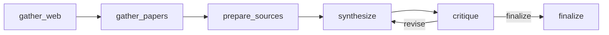

# Multi-Agent Research System (LangGraph)

**Repository:** [github.com/ArttuAn/multi-agent-research-system](https://github.com/ArttuAn/multi-agent-research-system)

Stateful multi-agent research pipeline: **web search (Tavily)** → **academic papers (Semantic Scholar)** → **synthesized cited report (OpenAI)** → **critique agent** (structured hallucination check) with optional **revise loop**.

Default demo topic: **“AI regulation in Europe 2026”** (edit freely in the UI).

## Why LangGraph

This uses [LangGraph](https://github.com/langchain-ai/langgraph) for explicit graph state, conditional edges, and iteration—patterns closer to production agent orchestration than a single ReAct loop. *CrewAI* is a reasonable alternative for role-based crews; this repo standardizes on LangGraph for the graph-native control flow.

## Architecture



- **gather_web**: Tavily `search` API (advanced depth).
- **gather_papers**: Semantic Scholar Graph API `paper/search` (no key required; optional `SEMANTIC_SCHOLAR_API_KEY` for higher limits).
- **prepare_sources**: Builds a numbered index `[W1]…`, `[P1]…` so the writer and critic share the same evidence bundle.
- **synthesize**: LLM emits markdown with mandatory inline `[Wn]` / `[Pm]` citations.
- **critique**: Structured output (`approved`, `hallucination_risk`, `issues`, `revision_guidance`) comparing the draft to the source index only.
- **finalize**: Appends critique summary to the delivered report.

## Setup

```bash
python -m venv .venv
.venv\Scripts\activate   # Windows
# source .venv/bin/activate  # macOS/Linux
pip install -r requirements.txt
copy .env.example .env   # Windows; use cp on Unix
```

Fill in `.env`:

- `TAVILY_API_KEY` — [Tavily](https://tavily.com/)
- `OPENAI_API_KEY` — OpenAI API
- Optional: `OPENAI_MODEL` (default `gpt-4o-mini`), `SEMANTIC_SCHOLAR_API_KEY`

## Live demo (Streamlit)

```bash
streamlit run app.py
```

### Streamlit Community Cloud

1. Push this repo to GitHub.
2. [New app](https://share.streamlit.io/) → select the repo, main file `app.py`, Python 3.11+.
3. Under **Secrets**, add:

```toml
TAVILY_API_KEY = "..."
OPENAI_API_KEY = "..."
```

## Programmatic use

```python
from research_system.graph import run_research

state = run_research("AI regulation in Europe 2026", max_iterations=3)
print(state["final_report"])
```

## License

MIT
